# Virtual Population Lab — Report

_Auto-generated on 2026-09-21 13:10 from `grape_berry`. Re-run `make run CONFIG=grape_berry` to refresh._

## Objective

Compare modeling engines on how well each generates a synthetic population that preserves the real population's feature distributions, correlations, and uncertainty.

## Data

- Source file: `data/cleaned-grape-berry.csv`
- Source dataset: https://doi.org/10.6084/m9.figshare.28308986
- Features (7): Glucose, Fructose, MalicAcid, TartaricAcid, Potassium, Magnesium, Calcium
- Rows after cleaning: 1536 — split into 1075 train / 461 test (`TEST_SIZE=0.3`)

## Methodology

**Physics-Informed Monte Carlo** (`src.generators.physics_mc_generator.generate`)

Generates synthetic rows via forward Monte Carlo sampling over a
caller-supplied causal graph:

- Each variable in `root_variables` is drawn from its own real marginal
  distribution (assumed Gaussian).
- Each (parent, child) edge in `causal_graph` draws `child` from a
  linear relationship fit on the real data, plus residual noise sampled
  at that fit's real residual std.

Every conditional here is a Gaussian we can sample directly, so plain
ancestral Monte Carlo sampling (this function) is exact — there's no
intractable distribution to approximate, so no need for MCMC.

The causal structure and roots are dataset knowledge supplied by the caller
(see src/configs/) — this function has no dataset-specific assumptions baked
in, so it works unchanged for a different set of features and relationships.

**Mcmc** (`src.generators.mcmc_generator.generate`)

Generate `n_samples` synthetic rows by Gaussian-copula Gibbs MCMC.

`df`      real data (in source units); `features` the columns to model.
`constraints`  optional list of callables row_dict -> bool (True = feasible).
               Infeasible Gibbs draws are rejected and redrawn (constrained
               MCMC); pass None for the unconstrained sampler.
`chain_length` total Gibbs sweeps; defaults to burn_in + thin*n_samples.
`burn_in`, `thin`  standard MCMC burn-in and thinning.
`max_reject`   per-sample redraw cap before the draw is accepted anyway
               (keeps a hard constraint from stalling the chain).

Returns a DataFrame in real units with the real marginals reproduced and the
data's joint correlation preserved through the copula.

**Regression** (`src.generators.regression_generator.generate`)

For each feature, fits one RandomForestRegressor (on train_df) predicting it
from the other features. Synthetic rows are built from a base row's
prediction plus noise, so outputs vary instead of collapsing to a
deterministic point estimate.

Both the base rows and the residual noise come from out-of-bag (OOB)
predictions rather than a held-out split. A random forest bags each tree on a
bootstrap sample, so roughly a third of the trees never saw any given
training row; `oob_prediction_` averages only those trees, giving a
leakage-free prediction for every training row. That lets this generator seed
itself entirely from train_df, never touching the evaluation set, with no
data sacrificed to a separate base split. It also makes the residuals
out-of-sample rather than in-sample, so the bootstrapped noise reflects
predictive uncertainty instead of understating it.

**Variational Autoencoder** (`src.generators.vae_generator.generate`)

Trains on `x` (expected to already be reasonably scaled) and samples
`n_samples` new rows from the prior. Pass a fitted `scaler` only if `x`
needs to be inverse-transformed back to source units afterwards —
leave it None when the source data is already standardized, since
there's no original unscaled space to return to.

Loss is the standard VAE ELBO (reconstruction MSE plus the analytic KL
divergence between the approximate posterior N(mu, sigma^2) and the
standard normal prior, weighted by `beta`), plus a covariance-matching
term weighted by `cov_weight`: the squared difference between the
reconstructed batch's covariance matrix and the real batch's. The ELBO
alone has no direct incentive to get cross-feature correlations right — it
only rewards accurate per-point reconstruction — so this term applies
direct pressure toward preserving joint structure. `beta` is linearly
annealed from 0 up to its target value over the first `kl_warmup_frac` of
training — without this, the KL term can dominate before reconstruction has
learned anything, collapsing the model onto near-zero variance (i.e.
generated samples clustering tightly around the mean).

With `use_minibatch=True`, each epoch shuffles the data and takes one
gradient step per `batch_size` chunk instead of one step over the whole
dataset — the added stochastic noise can help escape a plateaued loss
that full-batch descent gets stuck in. Set `use_minibatch=False` for
very small datasets, where a mini-batch may be too small to estimate a
stable gradient at all.

Training stops early once the loss hasn't improved for `patience`
epochs, checked only after the KL warmup finishes — beta is still
rising during warmup, so the loss naturally shifts then regardless of
real convergence, and checking during that window would trigger a
spurious early stop.

`hidden_dim` and `dropout` control model capacity — the defaults (128,
0.0) fit a few-thousand-row dataset comfortably, but on a small dataset
(dozens to low hundreds of rows) that many parameters can memorize
training noise instead of generalizing. Shrink `hidden_dim` and/or add
dropout (e.g. 0.1-0.3) if the generalization check shows a large
train/test gap.

`free_bits` floors the KL cost per latent dimension: once a dimension's
KL drops below this many nats, it stops contributing gradient to the KL
term (though reconstruction can still make it informative). Without
this (free_bits=0.0), KL annealing alone can still let every dimension
collapse fully to the prior on some datasets — recon_loss plateauing
at ~1.0 on standardized data (i.e. no better than always predicting the
mean) with KL near zero is the signature to watch for. Try 0.5-2.0 if
that happens.

**Physics-Informed VAE** (`src.generators.hybrid_vae_generator.generate`)

The physics-informed VAE (PI-VAE): the same generative model as the plain
VAE, plus a physics-consistency loss that injects the caller-supplied causal
graph into training. It keeps the VAE's data-driven strengths (a learned
latent joint, novel-individual sampling, no handcrafted marginals) while
borrowing the physics-informed Monte Carlo generator's domain knowledge: the
fitted linear-Gaussian relationship on each causal edge.

Each (parent, child) edge in `causal_graph` is fit once on the real data
(slope, intercept, residual variance — the same conditionals the physics-MC
generator samples). Those constants become a differentiable penalty (see
`_physics_loss`), weighted by `physics_weight`, that pushes each batch onto
the mechanistic relationships while matching their real residual spread, so
the constraint guides the generative manifold toward physically consistent
samples without re-introducing variance shrinkage.

Trains on `x` (expected already reasonably scaled) and samples `n_samples`
rows from the prior; pass a fitted `scaler` only if `x` needs
inverse-transforming back to source units. Loss is the standard VAE ELBO
(reconstruction MSE + analytic KL to the standard-normal prior, `beta`
linearly annealed from 0 over the first `kl_warmup_frac` of training to avoid
posterior collapse), plus a covariance-matching term (`cov_weight`) that
rewards preserving the full correlation matrix, plus the physics term
(`physics_weight`). `cov_weight` shapes the whole covariance structure from
data; `physics_weight` anchors the specific mechanistic edges an expert
asserts. Set `physics_weight=0.0` to recover the plain VAE.

A fourth term, weighted by `marginal_weight`, is the per-feature 1D
Wasserstein distance (see `_marginal_loss`) between samples drawn from the
prior and the real batch. It shapes every generated feature's whole
distribution onto real, including the causal-graph root variables that the
physics term leaves unconstrained; set `marginal_weight=0.0` to disable it.

`prior_type` chooses how latents are drawn at generation and for the
generated-sample loss terms: "standard" samples the N(0, I) prior,
"aggregate" samples the aggregate posterior over the training rows (see
`_decode_samples`).

`constrain_generated` routes the covariance and physics terms onto a batch of
freshly generated rows instead of the reconstructions, so those constraints
shape the population actually sampled at generation. The default (False)
keeps them on reconstructions, matching the plain VAE's convention.

`calibrate_marginals` applies the empirical-copula post-step (see
`_calibrate_marginals`): each feature is mapped onto the real training
marginal at matching quantiles, forcing every marginal to match real almost
exactly while preserving the learned rank dependence. A run using it is
marginal-calibrated rather than purely learned. Default False.

`use_minibatch`, `batch_size`, `patience`, `hidden_dim`, `dropout`, and
`free_bits` behave as in the plain VAE generator — see its docstring for the
capacity, collapse, and early-stopping trade-offs.

## Results

| Engine | Correlation Distance (Euclidean) | Mean KS Statistic |
|---|---|---|
| Physics-Informed Monte Carlo | 2.9079 | 0.1951 |
| Mcmc | 0.9588 | 0.0475 |
| Regression | **0.3380** | 0.0586 |
| Variational Autoencoder | 0.5289 | 0.2309 |
| Physics-Informed VAE | 0.4464 | **0.0409** |

(Lower is better for both metrics; bold = best.)

## Findings

- Best **Correlation Distance (Euclidean)**: Regression (0.3380)
- Best **Mean KS Statistic**: Physics-Informed VAE (0.0409)

Per-feature marginal fit (two-sample KS test, real vs. generated; lower ks_stat / higher p_value = closer):

- **Physics-Informed Monte Carlo**: 6/7 features statistically distinguishable from real (p < 0.05)
- **Mcmc**: 0/7 features statistically distinguishable from real (p < 0.05)
- **Regression**: 2/7 features statistically distinguishable from real (p < 0.05)
- **Variational Autoencoder**: 7/7 features statistically distinguishable from real (p < 0.05)
- **Physics-Informed VAE**: 0/7 features statistically distinguishable from real (p < 0.05)

## Per-Feature KS Statistic

Lower = closer to real; bold = best per feature.

| Feature | Physics-Informed Monte Carlo | Mcmc | Regression | Variational Autoencoder | Physics-Informed VAE |
|---|---|---|---|---|---|
| Glucose | 0.1508 | 0.0390 | **0.0338** | 0.1639 | 0.0347 |
| Fructose | 0.1703 | 0.0435 | 0.0566 | 0.1710 | **0.0340** |
| MalicAcid | 0.2139 | 0.0394 | 0.0590 | 0.1584 | **0.0375** |
| TartaricAcid | 0.0642 | 0.0578 | **0.0308** | 0.0989 | 0.0347 |
| Potassium | 0.2937 | 0.0524 | 0.0714 | 0.2813 | **0.0394** |
| Magnesium | 0.2122 | 0.0628 | 0.0812 | 0.3952 | **0.0609** |
| Calcium | 0.2607 | **0.0378** | 0.0770 | 0.3477 | 0.0448 |

## Feature Spread Comparison

**Correlation Distance (Euclidean)** is scale-invariant — Pearson correlation ignores absolute spread, so a method can score well on it while its population is uniformly shrunk or stretched relative to real. This shows each engine's per-feature standard deviation as a fraction of real's (1.00 = matches real exactly; well below 1.00 = generated population is narrower than real).

| Feature | Real Std | Physics-Informed Monte Carlo | Mcmc | Regression | Variational Autoencoder | Physics-Informed VAE |
|---|---|---|---|---|---|---|
| Glucose | 223.634 | 226.707 (1.01x) | 217.770 (0.97x) | 224.857 (1.01x) | 184.553 (0.83x) | 217.863 (0.97x) |
| Fructose | 227.945 | 230.470 (1.01x) | 221.251 (0.97x) | 226.202 (0.99x) | 185.279 (0.81x) | 220.929 (0.97x) |
| MalicAcid | 157.759 | 151.147 (0.96x) | 151.164 (0.96x) | 154.185 (0.98x) | 126.747 (0.80x) | 152.139 (0.96x) |
| TartaricAcid | 56.807 | 56.991 (1.00x) | 55.091 (0.97x) | 57.077 (1.00x) | 56.646 (1.00x) | 56.914 (1.00x) |
| Potassium | 46.532 | 50.838 (1.09x) | 49.164 (1.06x) | 50.702 (1.09x) | 53.731 (1.15x) | 50.800 (1.09x) |
| Magnesium | 2.290 | 2.744 (1.20x) | 2.636 (1.15x) | 2.544 (1.11x) | 3.480 (1.52x) | 2.677 (1.17x) |
| Calcium | 4.081 | 5.205 (1.28x) | 4.502 (1.10x) | 4.802 (1.18x) | 8.090 (1.98x) | 5.251 (1.29x) |

## Generalization Check

Correlation distance for each engine's synthetic data against the train split it was fit on vs. the held-out test split it's actually scored on. A small gap is evidence results generalize rather than matching training-set noise a real (unseen) population wouldn't share.

| Engine | Correlation Dist. (vs. Train) | Correlation Dist. (vs. Test) | Gap |
|---|---|---|---|
| Physics-Informed Monte Carlo | 2.9133 | 2.9079 | 0.0055 |
| Mcmc | 1.0316 | 0.9588 | 0.0727 |
| Regression | 0.3272 | 0.3380 | 0.0109 |
| Variational Autoencoder | 0.4829 | 0.5289 | 0.0460 |
| Physics-Informed VAE | 0.2405 | 0.4464 | 0.2058 |

## Downstream Utility (TSTR)

Train-on-Synthetic, Test-on-Real for the `Genotype` label: a RandomForest is trained on each engine's synthetic population (labels produced by generating each class separately) and scored on the real held-out test set. **Real (TRTR)** — a classifier trained on real data — is the ceiling; the closer an engine gets to it, the more genuinely useful its synthetic population is. This rewards preserving the feature-label joint structure, not just the marginals.

| Trained on | Accuracy | ROC-AUC |
|---|---|---|
| **Real (TRTR ceiling)** | 0.7722 | n/a |
| Physics-Informed Monte Carlo | 0.4056 | n/a |
| Mcmc | 0.6616 | n/a |
| Regression | 0.7007 | n/a |
| Variational Autoencoder | 0.6377 | n/a |
| Physics-Informed VAE | 0.6898 | n/a |

(Higher is better; closer to the Real ceiling = more useful synthetic data.)

## Uncertainty Calibration (Coverage)

Tests the *calibrated uncertainty* claim directly. For each feature, the central 90% interval of each engine's generated population is formed, and we measure the fraction of real held-out values that fall inside it (averaged over features). Well-calibrated ⇒ coverage ≈ the nominal 0.90; **below** = over-confident (intervals too narrow), **above** = intervals too wide. `calibration_error` is the mean absolute gap between empirical and nominal coverage across interval levels from 0.10 to 0.95 (lower = better calibrated across the whole range).

| Engine | Coverage @ 90% (nominal 0.90) | Calibration Error |
|---|---|---|
| Physics-Informed Monte Carlo | 0.936 | 0.1008 |
| Mcmc | 0.883 | 0.0254 |
| Regression | 0.928 | 0.0292 |
| Variational Autoencoder | 0.834 | 0.0935 |
| Physics-Informed VAE | 0.888 | **0.0215** |

(Coverage closest to nominal and lowest calibration error = best-calibrated uncertainty.)

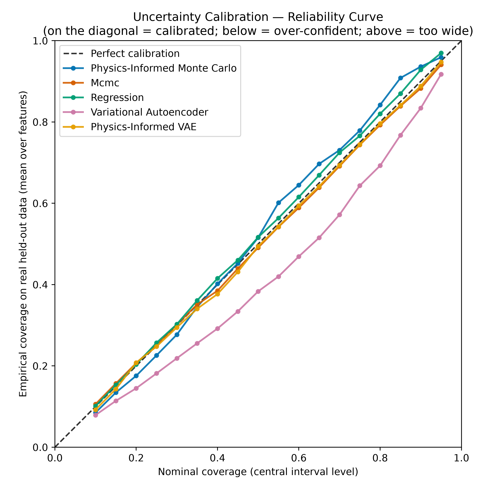

## Figures

### Joint variability (correlation)

**Correlation matrices**

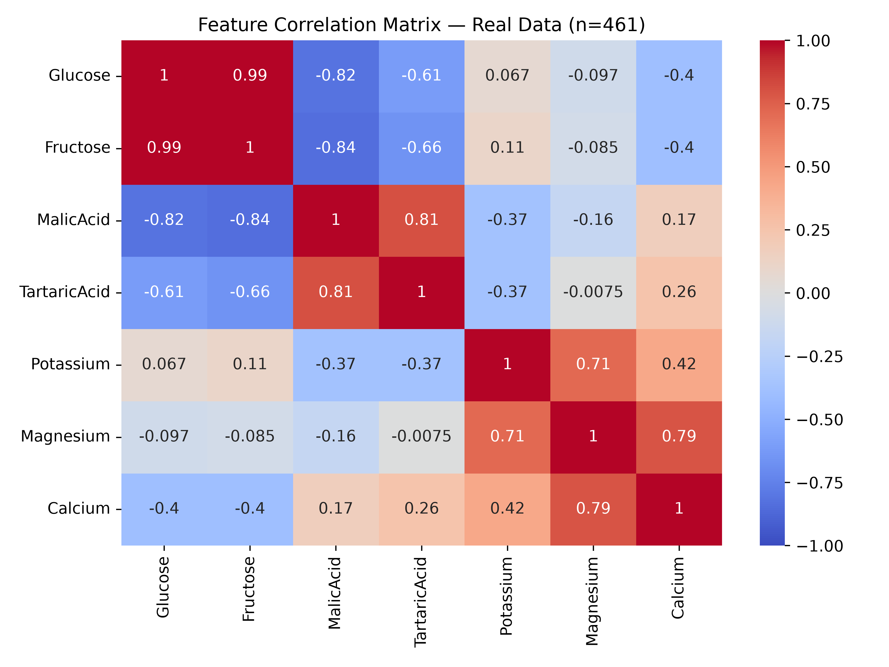
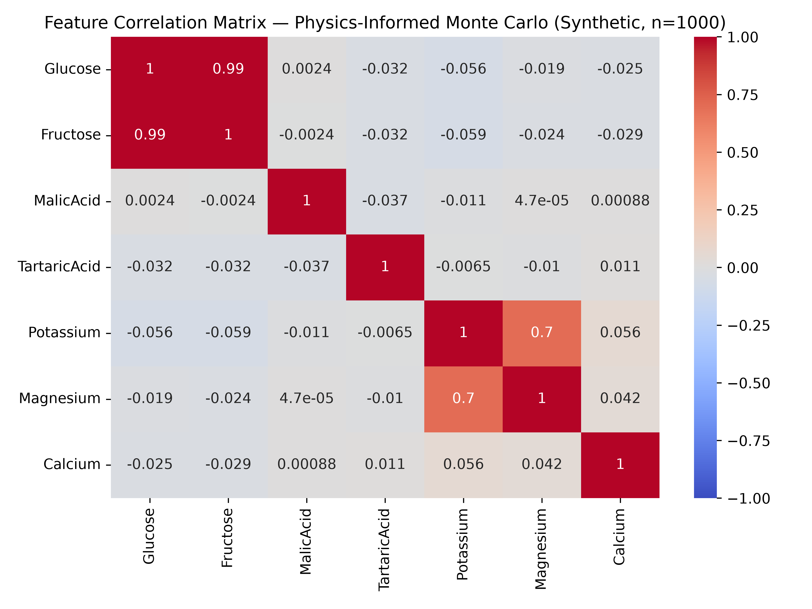
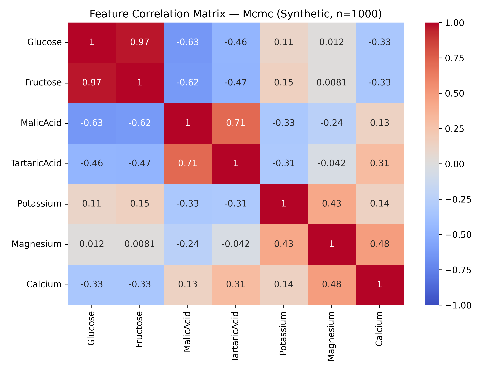

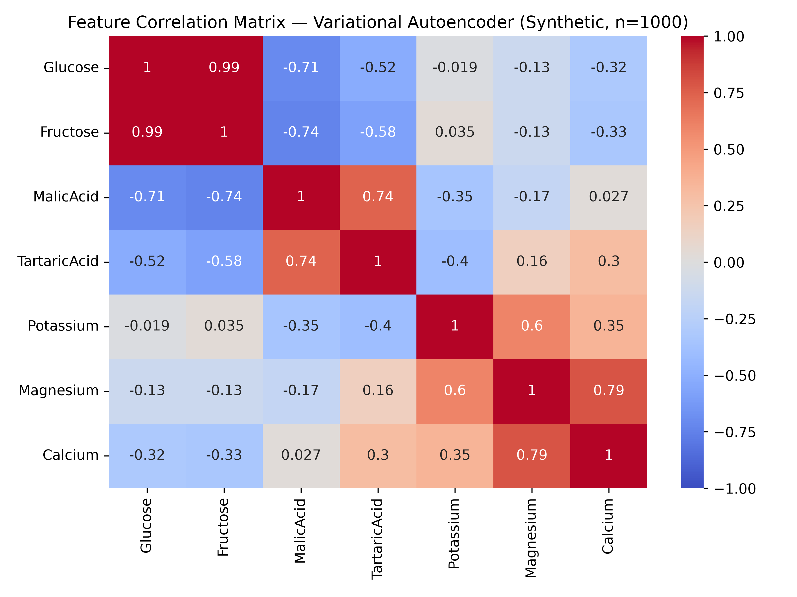

**PCA projection — real vs. each method, plus all combined**

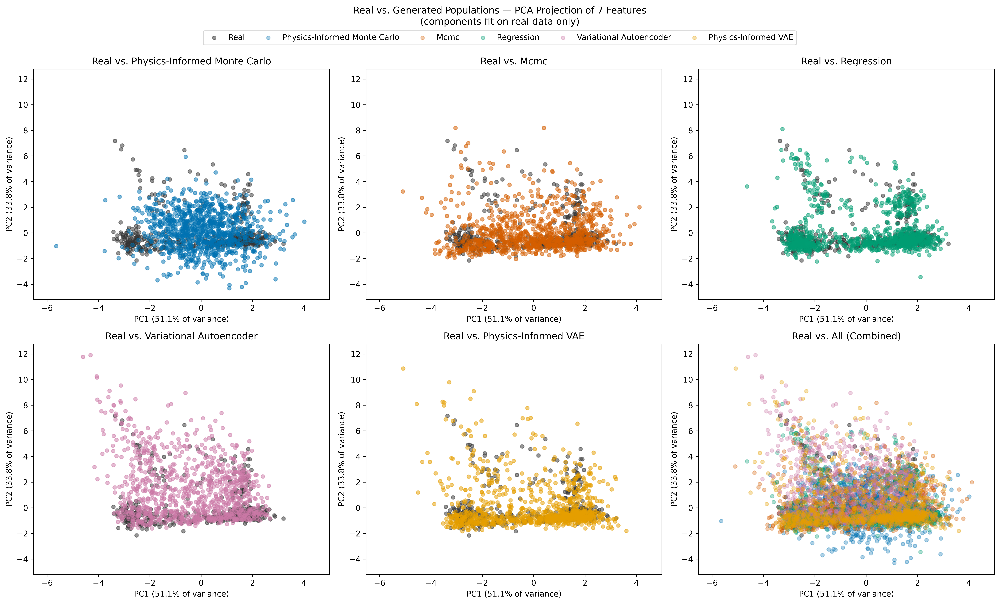

**PCA projection — each population shown individually, no overlay**

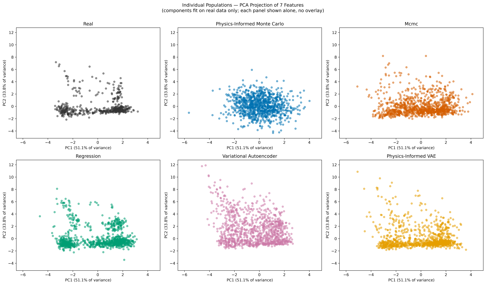

### Marginal distributions (KS)

**KS statistic by feature and method**

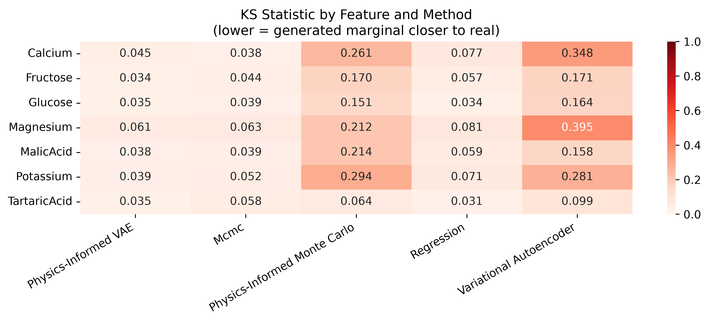

**Empirical CDFs — real vs. generated, per feature**

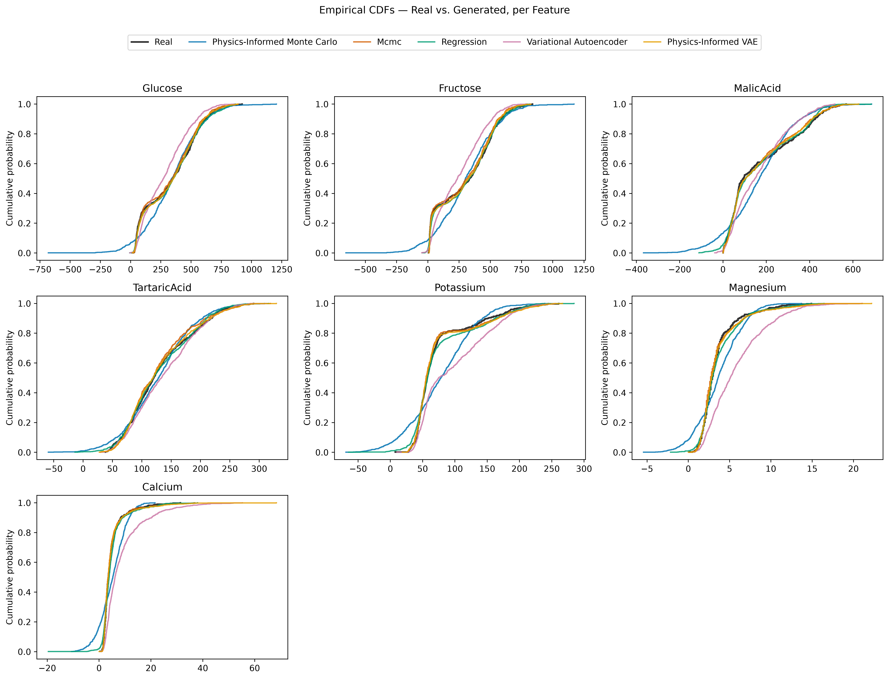

**P-value by feature and method**

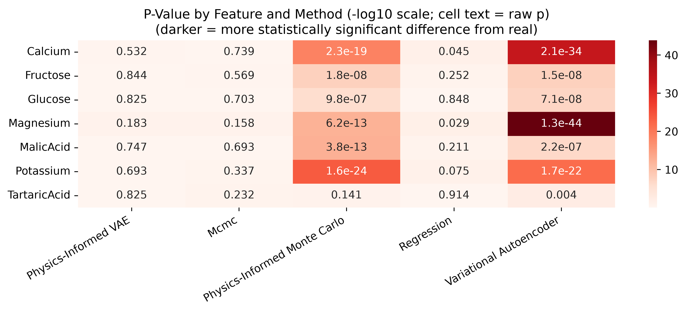

**Volcano plot — effect size vs. significance**

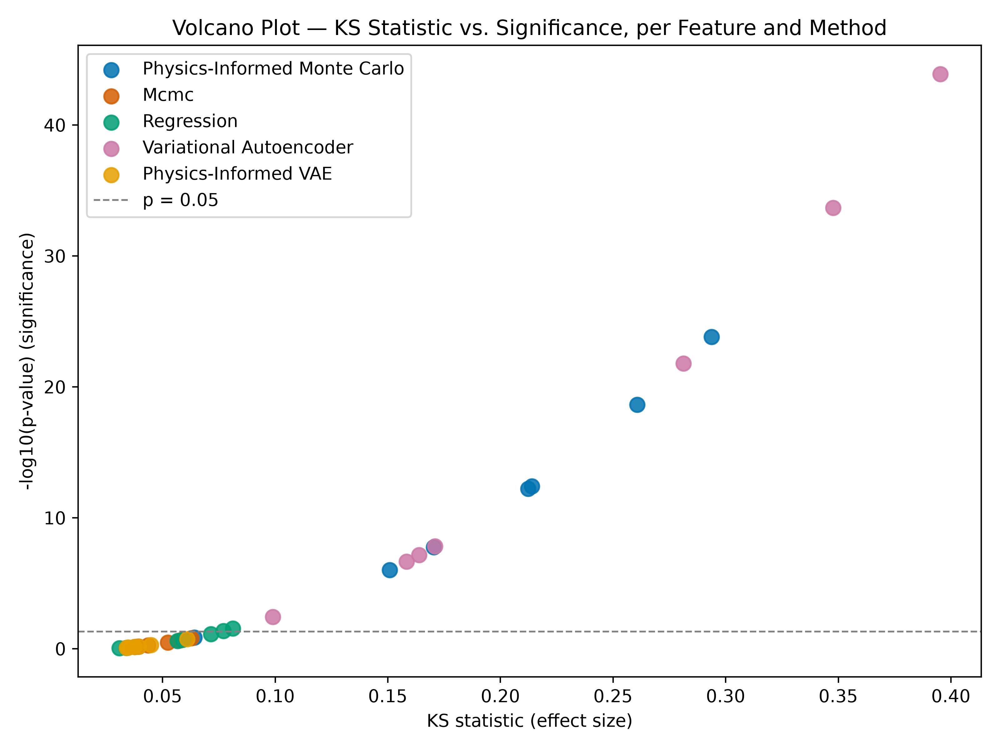

---

Raw data: `results/grape_berry/summary_metrics.csv`, `results/grape_berry/ks_marginals.csv`, `results/grape_berry/generalization_gap.csv`, `results/grape_berry/synthetic_data/`.
